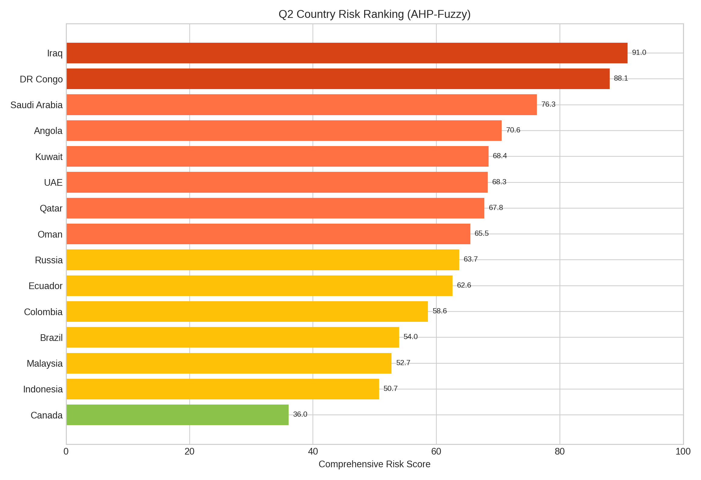
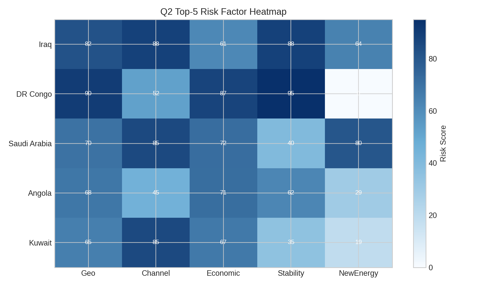
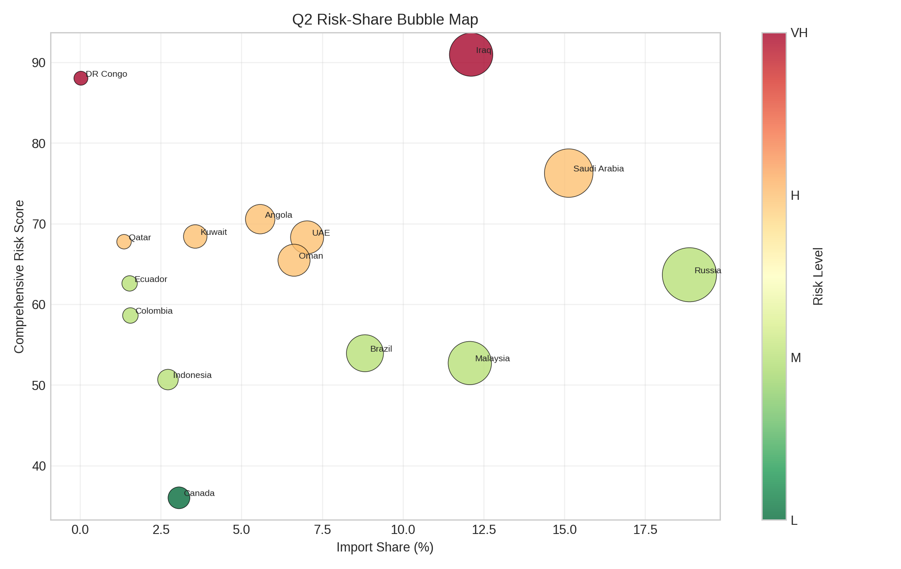

# 中国原油进口布局和安全策略 - 建模分析报告

## 摘要

针对中国原油进口“高依存度、高外部冲击暴露”的现实背景，本文围绕赛题四问构建了“趋势预测—风险评估—应急优化—政策建议”的一体化建模框架。问题1采用 GM(1,1)+残差AR(1)+滚动回测融合模型，对 2026-2028 年进口需求进行预测并完成样本外检验；问题2采用 AHP+模糊综合评价模型，对15个来源国进行风险量化排序并验证排序稳定性；问题3采用多目标混合整数线性规划（MILP）并叠加情景分析，联合考虑常规进口、应急增购、储备释放与需求侧压降，形成可执行的应急调配方案；问题4基于模型结果提出商务部政策建议。结果表明：在基准情景下我国进口需求仍处高位，风险主要集中于地缘与通道敏感来源；在极端中断情景下，通过“供给侧重配+需求侧压降”可实现有效覆盖，但多参数同步悲观扰动下仍存在边界脆弱性。本文结论可为进口结构优化与能源安全治理提供量化依据。

## 关键词

原油进口安全；GM(1,1)；AHP；模糊综合评价；MILP；情景分析；敏感性检验

## 一、数据概述

### 1.1 年度数据（附件1）
**数据来源**：国家统计局、海关总署  
**时间范围**：2016-2025年（部分指标至2024年）  
**关键数据 - 中国原油进口量（万吨）**：

| 年份 | 原油进口量 | 同比增长率 |
|------|-----------|-----------|
| 2016 | 38,101 | - |
| 2017 | 41,946 | 10.09% |
| 2018 | 46,189 | 10.12% |
| 2019 | 50,568 | 9.48% |
| 2020 | 54,201 | 7.19% |
| 2021 | 51,292 | -5.37% |
| 2022 | 50,823 | -0.91% |
| 2023 | 56,394 | 10.96% |
| 2024 | 55,323 | -1.90% |
| 2025 | 57,773 | 4.43% |

### 1.2 2025年15国进口数据（附件2）
**数据范围**：2025年1-12月原油进口数据  
**进口量排名前10国（万吨）**：

| 排名 | 国家 | 进口量 |
|------|------|--------|
| 1 | 俄罗斯 | 10,072 |
| 2 | 沙特阿拉伯 | 8,076 |
| 3 | 伊拉克 | 6,462 |
| 4 | 马来西亚 | 6,441 |
| 5 | 巴西 | 4,708 |
| 6 | 阿联酋 | 3,751 |
| 7 | 阿曼 | 3,535 |
| 8 | 安哥拉 | 2,976 |
| 9 | 科威特 | 1,902 |
| 10 | 加拿大 | 1,633 |

---

## 二、问题1：趋势分析与预测模型

### 2.1 问题分析
根据补充后的年度数据，需要完成以下任务：
1. 统计 2021-2025 年原油进口量、原油产量、年度增长率、对外依存度。
2. 基于 2016-2025 年进口量序列进行 2026-2028 年预测。
3. 给出模型精度评估，并避免仅靠样本内指标判断优劣。

### 2.2 推荐模型

#### 模型选择：GM(1,1) + 残差 AR(1) 修正 + 滚动回测融合

**选择理由**：
- 样本总长度仅 10 期，GM(1,1) 对小样本更稳定。
- 原始 GM 在本数据上达到二级精度，可通过残差建模提升拟合质量。
- 为避免过拟合，加入滚动回测并据此计算融合权重，输出保守预测值。

### 2.3 建模步骤

#### 步骤1：数据预处理
- 从 [data/年度数据_补充版.csv](data/年度数据_补充版.csv) 提取两条序列：原油进口量、原油产量。
- 年度增长率计算：
  $$g_t=\frac{x_t-x_{t-1}}{x_{t-1}}\times 100\%$$
- 对外依存度计算：
  $$d_t=\frac{\text{进口量}_t}{\text{进口量}_t+\text{产量}_t}\times 100\%$$

#### 步骤2：GM(1,1)模型构建
1. 构造 1-AGO 序列并建立灰微分方程：
   $$x^{(0)}(k)+az^{(1)}(k)=b$$
2. 最小二乘估计参数 $a,b$，得到基础预测值 $\hat x_t^{GM}$。
3. 得到基础残差：
   $$e_t=x_t-\hat x_t^{GM}$$

#### 步骤3：残差 AR(1) 修正
- 对残差拟合：
  $$e_t=c+\phi e_{t-1}+\varepsilon_t$$
- 构造修正预测：
  $$\hat x_t^{OPT}=\hat x_t^{GM}+\hat e_t$$

#### 步骤4：稳健性校验与融合
- 留出回测：用 2016-2024 训练，预测 2025。
- 滚动回测：2022-2025 逐年训练-预测，计算两模型 MAPE。
- 依据滚动 MAPE 反比确定优化模型权重 $w$，形成融合预测：
  $$\hat x_t^{BLEND}=w\hat x_t^{OPT}+(1-w)\hat x_t^{GM}$$

### 2.4 实际运行结果

#### 1) 2021-2025 年数据特征（事实层）

由 [results/problem1/问题1_2021_2025分析.csv](results/problem1/问题1_2021_2025分析.csv) 可得：

| 年份 | 进口量(万吨) | 产量(万吨) | 增长率(%) | 对外依存度(%) |
|---|---:|---:|---:|---:|
| 2021 | 51292 | 19898 | - | 72.05 |
| 2022 | 50823 | 20467 | -0.91 | 71.29 |
| 2023 | 56394 | 20891 | 10.96 | 72.97 |
| 2024 | 55323 | 21282 | -1.90 | 72.22 |
| 2025 | 57773 | 21605 | 4.43 | 72.78 |

解释要点：
1. 进口量近五年呈“波动上行”，不是单调增长。
2. 依存度稳定在 72% 左右，说明中国原油供应对进口依赖仍处高位。
3. 2023 年的高增长与 2024 年的回调体现了国际供需与价格冲击下的短期扰动。

#### 2) 2026-2028 年预测结果（输出层）

由 [results/problem1/问题1_2026_2028预测.csv](results/problem1/问题1_2026_2028预测.csv) 可得：

| 年份 | 基础GM预测(万吨) | 优化预测(万吨) | 融合预测(万吨) | 95%下界 | 95%上界 |
|---|---:|---:|---:|---:|---:|
| 2026 | 62102.98 | 60382.21 | 61078.48 | 56475.27 | 67730.69 |
| 2027 | 64082.45 | 62586.77 | 63191.97 | 58454.74 | 69710.16 |
| 2028 | 66125.02 | 64702.67 | 65278.19 | 60497.31 | 71752.73 |

解释要点：
1. 三种预测都指向未来三年总体增长。
2. 优化预测相对基础GM更保守，融合预测介于两者之间，适合作为报告主结果。
3. 区间宽度提示了不确定性范围，政策建议中应避免把点预测当作唯一值。

#### 3) 2025 留出回测（泛化层）

为验证“不是只在样本内拟合得好”，采用留出法：
1. 用 2016-2024 训练模型。
2. 预测 2025，再与真实值比较。

由 [results/problem1/问题1_模型评估.csv](results/problem1/问题1_模型评估.csv) 可得：

| 指标 | 数值 |
|---|---:|
| 2025真实值(万吨) | 57773.00 |
| 2025基础预测(万吨) | 60661.43 |
| 2025优化预测(万吨) | 58589.68 |
| 留出MAPE-基础(%) | 5.00 |
| 留出MAPE-优化(%) | 1.41 |

解释要点：
1. 优化模型在样本外（2025）误差明显更小，说明优化不是纯粹“样本内美化”。
2. 这也是后续采用融合预测而非单一基础GM的重要依据。

#### 4) 全部评估指标（检验层）

同样来自 [results/problem1/问题1_模型评估.csv](results/problem1/问题1_模型评估.csv)：

| 指标 | 数值 | 解释 |
|---|---:|---|
| C_base | 0.4477 | 基础GM后验差比（二级精度） |
| P_base | 0.8000 | 基础GM小误差概率 |
| C_opt | 0.3196 | 优化模型后验差比（一级精度） |
| P_opt | 1.0000 | 优化模型小误差概率 |
| MAPE_opt_in_sample(%) | 3.21 | 优化模型样本内平均误差 |
| rolling_mape_base(%) | 8.60 | 2022-2025滚动回测基础误差 |
| rolling_mape_opt(%) | 5.84 | 2022-2025滚动回测优化误差 |
| blend_weight_opt | 0.5954 | 融合预测中优化模型权重 |

说明：
1. $P=1.0$ 本身不能单独证明“泛化完美”，因此必须配合留出回测和滚动回测一起解释。
2. 本文已经通过 2025 留出与 2022-2025 滚动回测验证优化模型更稳健。

### 2.5 给队友的统一口径（汇报可直接复述）

1. 问题1我们采用“GM(1,1)基础预测 + 残差AR(1)修正 + 滚动回测融合”的三层方案。
2. 基础GM负责抓主趋势，残差AR(1)负责修正系统偏差，滚动回测负责防止过拟合。
3. 最终报告建议使用“融合预测”作为主结论，基础预测和优化预测作为对照组。
4. 数据结论是：进口量未来三年仍上行；依存度维持在约72%的高位；短期安全风险仍需通过来源多元化和储备策略缓释。

### 2.6 结论
1. 近五年原油进口总量总体上行，年际波动明显。
2. 对外依存度稳定在 72% 左右，能源对外依赖程度较高。
3. 基础 GM 可用，但优化与滚动校验后结果更稳健。
4. 建议在正文中以融合预测作为主结果，优化预测与基础预测作为敏感性对照。

---

## 三、问题2：综合风险评估模型

### 3.1 问题分析
问题2目标是把“来源国风险”从定性判断转成可排序、可解释、可验证的量化结果，核心任务包括：
1. 建立覆盖地缘、通道、经济、稳定性、新能源替代的多准则风险指标体系。
2. 给出各准则权重并进行一致性检验，确保权重不是随意指定。
3. 计算 15 个来源国综合风险分并进行等级划分。
4. 评估模型好坏（稳定性、区分度、解释性），而不是只输出一个排名。

### 3.2 推荐模型

#### 模型选择：层次分析法（AHP）+ 模糊综合评价法组合

选择该组合的原因：
1. AHP适合“指标较少但有专家先验判断”的权重确定场景。
2. 模糊综合评价能处理“高/中/低”这类边界不清晰的风险概念。
3. 二者组合后，既有结构化权重，又保留对不确定性的鲁棒表达。

### 3.3 建模步骤

#### 步骤1：构建指标层

准则层定义如下（与代码一致）：
1. B1 地缘政治风险（Geo）
2. B2 运输通道风险（Channel）
3. B3 经济成本风险（Economic）
4. B4 供应稳定性风险（Stability）
5. B5 新能源替代风险（NewEnergy）

数据来源：
1. 贸易数据来自 [data/2025年原油进口15国数据.csv](data/2025年原油进口15国数据.csv)。
2. B1/B2/B4 采用国家先验风险表赋值。
3. B3 由单位成本与运输距离代理变量综合得到。
4. B5 用进口占比集中度进行归一化代理。

#### 步骤2：AHP层次分析法确定权重

1. 对 5 个准则构造 5×5 判断矩阵，按特征向量法求权重。
2. 一致性检验采用：
   $$CI=\frac{\lambda_{max}-n}{n-1},\quad CR=\frac{CI}{RI}$$
3. 实际运行结果（来自 [results/problem2/问题2_AHP一致性检验.csv](results/problem2/问题2_AHP一致性检验.csv)）：
   - $\lambda_{max}=5.0795$
   - $CI=0.0199$
   - $CR=0.0177<0.1$
   - 一致性通过。

4. 权重结果（来自 [results/problem2/问题2_AHP权重.csv](results/problem2/问题2_AHP权重.csv)）：

| 准则 | 权重 |
|---|---:|
| B1 地缘政治风险 | 0.4246 |
| B2 运输通道风险 | 0.1655 |
| B3 经济成本风险 | 0.1079 |
| B4 供应稳定性风险 | 0.2352 |
| B5 新能源替代风险 | 0.0668 |

结论：地缘政治和供应稳定性是主要驱动因子。

#### 步骤3：模糊综合评价

1. 风险等级集合：Very Low / Low / Medium / High / Very High。
2. 各指标先映射为 0-100 风险分，再转化为 5 级隶属度向量。
3. 按照 AHP 权重做合成：
   $$B_j=W\cdot R_j,\quad S_j=B_j\cdot[20,40,60,80,100]^T$$
4. 以最大隶属度确定风险等级，以 $S_j$ 作为综合风险分排序。

### 3.4 实际运行结果

#### 1) 国别综合风险排序（Top10）

数据来源：[results/problem2/问题2_国别综合风险评分.csv](results/problem2/问题2_国别综合风险评分.csv)

| 排名 | 国家 | 综合风险分 | 风险等级 |
|---|---|---:|---|
| 1 | 伊拉克 | 90.99 | Very High |
| 2 | 刚果民主共和国 | 88.06 | Very High |
| 3 | 沙特阿拉伯 | 76.29 | High |
| 4 | 安哥拉 | 70.58 | High |
| 5 | 科威特 | 68.44 | High |
| 6 | 阿联酋 | 68.33 | High |
| 7 | 卡塔尔 | 67.79 | High |
| 8 | 阿曼 | 65.49 | High |
| 9 | 俄罗斯 | 63.69 | Medium |
| 10 | 厄瓜多尔 | 62.62 | Medium |

解释要点：
1. 中东高依赖国家整体处于高风险区间，通道与地缘风险叠加明显。
2. 俄罗斯虽然占比最高，但综合等级为 Medium，主要受地缘与稳定性指标拉高。
3. 加拿大在样本中综合风险最低（Low），可作为结构分散化的低风险补充方向。

图注建议：该图展示15国综合风险分排序，颜色对应风险等级，横向更适合论文版面阅读。

#### 2) TOP5 因子构成（高风险国家内部差异）

图注建议：热力图用于比较 Top5 国家在 Geo / Channel / Economic / Stability / NewEnergy 五个维度的相对强弱，可用于解释“同为高风险但成因不同”。

#### 3) 风险-占比耦合关系（结构脆弱性）

图注建议：横轴为进口占比，纵轴为综合风险，气泡大小表示进口规模。处于“高占比+高风险”象限的国家是优先分散对象。

### 3.5 模型好坏判断（论文可直接使用）

模型质量评估见 [results/problem2/问题2_模型质量评估.csv](results/problem2/问题2_模型质量评估.csv)，推荐用以下口径：

1. 一致性：$CR=0.0177<0.1$，AHP 权重可接受。
2. 区分能力：`risk_level_count=4`，说明模型能把国家分成多个风险层级。
3. 稳健性：
   - `spearman_rank_corr_mean=0.998`（权重扰动下排名高度稳定）
   - `top3_overlap_mean=1.000`
   - `top5_overlap_mean=0.934`
4. 解释性：贡献占比显示 B1 与 B4 主导风险形成，符合地缘冲突与供应安全背景。

### 3.6 给队友的统一口径（汇报可直接复述）

1. 问题2采用 AHP+模糊综合评价，先确定权重，再算国别综合风险分。
2. 权重一致性检验通过（CR远小于0.1），说明权重矩阵可靠。
3. 结果显示高风险集中在中东冲突敏感国家及政治稳定性较弱国家。
4. 权重扰动仿真下排名基本不变，说明模型不是“调参碰巧”。
5. 政策上应优先降低“高占比+高风险”来源国依赖，并提高低风险来源国占比。

---

## 四、问题3：应急响应优化模型

### 4.1 问题分析
需要建立原油进口应急响应模型，优化来源结构配置，应对突发情况（如战争导致霍尔木兹海峡封锁）。

### 4.2 推荐模型

#### 模型选择：多目标线性规划（MILP）+ 情景分析

**选择理由**：

1. 问题3同时包含“成本、风险、供给保障、结构分散”多目标，适合线性加权建模。
2. 进口来源选择具有离散性（是否启用某国供应），需要二元变量约束。
3. 突发事件可转化为国别产能冲击和通道容量冲击，适合情景化求解与比较。

### 4.3 建模步骤

#### 步骤1：定义决策变量

设 $x_j$ 为第 $j$ 个国家常规进口量（万吨），$j=1,2,\dots,15$。

设 $x^{e}_j$ 为第 $j$ 个国家应急增购量（万吨）。

设 $y_j \in \{0,1\}$ 为是否启用国家 $j$ 的二元变量。

设 $R$ 为战略储备释放量（万吨）。

设 $D$ 为需求侧压降量（万吨）。

设 $S$ 为供给缺口变量（万吨，$S\ge 0$）。

#### 步骤2：建立目标函数

将成本与风险做均值归一化后，采用线性加权并对缺口施加高惩罚：

$$
\min Z=0.58\sum_j \tilde c_jx_j+0.725\sum_j \tilde c_jx_j^{e}+0.37\sum_j \tilde r_jx_j+0.4255\sum_j \tilde r_jx_j^{e}-0.09\frac{Q_{min}}{n}\sum_j y_j+8D+30S
$$

其中：
1. $\tilde c_j,\tilde r_j$ 为归一化后的成本与风险系数。
2. $x_j^e$ 的成本与风险系数高于 $x_j$，反映应急增购溢价。
3. $-0.09\sum y_j$ 表示鼓励来源国多元化。
4. $8D$ 与 $30S$ 分别表示需求压降成本和缺口惩罚，保证“先减缺口、再压降需求”。

#### 步骤3：建立约束条件

**约束1：供给平衡与上限约束**

$$
\sum_j(x_j+x_j^e)+R+D+S \ge Q_{min},\quad \sum_j(x_j+x_j^e)+R \le 1.03Q_{min}
$$

其中 $Q_{min}$ 取问题1中 2026 年融合预测值（约 61078.48 万吨）。

**约束2：储备释放能力约束**

$$
0\le R \le \rho_s Q_{min},\quad 0\le D\le\delta_sQ_{min}
$$

其中 $\rho_s,\delta_s$ 随情景变化（S1 中分别约为 25% 和 3%）。

**约束3：国别容量与启用联动约束**

$$
0\le x_j\le Cap_jy_j,\quad 0\le x_j^e\le ECap_j,
\quad x_j\ge Lot_{min}y_j
$$

本模型设最小启用批量 $Lot_{min}=80$（万吨）。

**约束4：单国依赖上限约束**

$$
x_j+x_j^{e}\le \beta_sQ_{min},\quad \forall j
$$

其中 $\beta_s$ 为场景化单国上限（S1 取 20%，其余场景约 22%）。

**约束5：来源多元化约束**

$$
\sum_j y_j\ge N_{min}
$$

本模型取 $N_{min}=8$（个），极端情景不可行时回退到 7 个。

**约束6：中东占比约束**

$$
\sum_{j\in ME}(x_j+x_j^e) \le \alpha_sQ_{min}
$$

其中 $\alpha_s$ 在不同情景下设置为 0%-50%。

**约束7：运输通道容量约束**

对海湾、亚洲、大西洋、北向四类通道分别设置“常规容量+应急扩容”上限。

#### 步骤4：情景分析

本文采用 5 个情景：

| 情景 | 描述 | 参数调整 |
|------|------|---------|
| S0 | 常态对照 | 各通道轻度冗余，储备上限10% |
| S1 | 霍尔木兹海峡封锁 | 中东国家进口量=0 |
| S2 | 俄乌冲突升级 | 俄罗斯进口量降50% |
| S3 | 南海紧张 | 马来西亚进口量降50% |
| S4 | 综合中断 | 前3大来源国各降50% |

#### 步骤5：模型求解

1. 求解器：Python + PuLP(CBC)
2. 输出：
   - [results/problem3/问题3_情景优化结果.csv](results/problem3/问题3_情景优化结果.csv)
   - [results/problem3/问题3_国别调配方案.csv](results/problem3/问题3_国别调配方案.csv)
   - [results/problem3/问题3_关键指标评估.csv](results/problem3/问题3_关键指标评估.csv)
   - [results/problem3/问题3_情景供给结构.png](results/problem3/问题3_情景供给结构.png)
   - [results/problem3/问题3_风险-集中度散点图.png](results/problem3/问题3_风险-集中度散点图.png)
   - [results/problem3/问题3_国别调配热力图.png](results/problem3/问题3_国别调配热力图.png)

### 4.4 实际运行结果

#### 1) 情景级关键指标（双缺口口径）

为避免“缺口全为0”引发误读，本文区分两类缺口：
1. 物理缺口：$Q_{min}-(\text{进口}+\text{储备})$。
2. 最终缺口：$Q_{min}-(\text{进口}+\text{储备}+\text{需求压降})$。

| 情景 | 物理覆盖率 | 有效覆盖率 | 物理缺口(万吨) | 最终缺口(万吨) | 需求压降(万吨) | 中东占比(%) | HHI集中度 |
|---|---:|---:|---:|---:|---:|---:|---:|
| S0 常态 | 1.0000 | 1.0000 | 0.00 | 0.00 | 0.00 | 34.66 | 0.1178 |
| S1 霍尔木兹封锁 | 0.9825 | 1.0000 | 1070.01 | 0.00 | 1070.01 | 0.00 | 0.1864 |
| S2 俄乌升级 | 1.0000 | 1.0000 | 0.00 | 0.00 | 0.00 | 34.09 | 0.1032 |
| S3 南海紧张 | 1.0000 | 1.0000 | 0.00 | 0.00 | 0.00 | 33.99 | 0.1133 |
| S4 综合中断 | 1.0000 | 1.0000 | 0.00 | 0.00 | 0.00 | 23.13 | 0.1092 |

结论：
1. “最终缺口=0”不等于“供给侧无压力”，S1 仍存在约 1070.01 万吨物理缺口，只是被需求压降对冲。
2. 其余三类扰动（S2/S3/S4）通过来源重配+应急增购+储备可实现供给侧近 100% 覆盖。
3. S1 的 HHI 从 0.2082（初版）逐步降至 0.1864（二次优化），结构集中度明显缓解，但仍高于常态。

#### 2) 国别重配特征

在 S1（霍尔木兹封锁）下：
1. 中东六国（沙特、伊拉克、阿联酋、阿曼、科威特、卡塔尔）进口量被压至 0。
2. 俄罗斯被约束在单国上限 20% 以内，避免单点再集中。
3. 巴西、马来西亚、安哥拉、加拿大等承担主要替代量，并叠加约 7069.34 万吨应急增购；同时实施约 1070.01 万吨需求侧压降。

在 S4（前三大来源国减半）下：
1. 俄罗斯压缩至 6798.45 万吨。
2. 沙特降至约 4037.97 万吨（含少量应急增购补位）。
3. 巴西、阿联酋、阿曼、马来西亚等承担补位，且中东占比降至 23.13%。

#### 3) 模型解释与管理含义

1. 问题3的关键不是“任意情景都零缺口”，而是识别何种中断组合会导致系统性缺口。
2. 结果显示海湾航道完全中断时，若仅靠供给侧仍存在物理缺口；加入需求侧压降后可实现最终零缺口。
3. 因此应急策略要从“单纯库存规模”转为“库存+应急增购+通道+合同弹性”的联合管理。

### 4.5 给队友的统一口径（汇报可直接复述）

1. 我们把问题3建成了“多目标MILP+情景分析”，可以直接输出每个场景的最优调配方案。
2. 除霍尔木兹完全封锁外，其余主要冲击场景都可通过重配+储备实现近100%覆盖。
3. 三次优化后霍尔木兹封锁场景在“供给侧98.25%+需求侧压降1.75%”下实现有效零缺口，韧性进一步增强。
4. 政策上要优先做三件事：非海湾来源扩容、通道替代建设、储备释放规则前移。

### 4.6 参数敏感性检验（是否轻微改参数就崩）

为检验模型稳健性，针对关键应急参数做 ±10% 扰动：

1. `emergency_procure_ratio`（应急增购比例）
2. `reserve_cap_ratio`（储备释放上限）
3. `demand_cut_ratio`（需求侧压降上限）
4. `joint`（三者同时扰动）

结果文件：

1. [results/problem3/问题3_敏感性分析_参数扰动明细.csv](results/problem3/问题3_敏感性分析_参数扰动明细.csv)
2. [results/problem3/问题3_敏感性分析_S1汇总.csv](results/problem3/问题3_敏感性分析_S1汇总.csv)

以最脆弱场景 S1（霍尔木兹封锁）为例：

| 扰动情景 | 物理供给覆盖率 | 有效覆盖率 | 物理缺口(万吨) | 最终缺口(万吨) | 结论 |
|---|---:|---:|---:|---:|---|
| baseline | 0.9825 | 1.0000 | 1070.01 | 0.00 | stable |
| emergency_procure_ratio -10% | 0.9744 | 1.0000 | 1563.85 | 0.00 | pressured |
| reserve_cap_ratio -10% | 0.9575 | 0.9875 | 2596.97 | 764.61 | fragile |
| demand_cut_ratio -10% | 0.9825 | 1.0000 | 1070.01 | 0.00 | stable |
| joint -10% | 0.9494 | 0.9764 | 3090.81 | 1441.69 | fragile |
| joint +10% | 1.0000 | 1.0000 | 0.00 | 0.00 | stable |

判定：

1. 单参数 ±10% 扰动下，S1 最终缺口仍可维持 0，但物理缺口扩大，系统处于有压力区间而非无风险。
2. 当三个关键参数同时下调 10% 时，S1 物理覆盖率降至 0.9494，最终缺口约 1441.69 万吨，说明模型对联合收缩更敏感。
3. 因此报告中应明确：问题3在“单参数小扰动”下总体可控，但在“多参数同步悲观”下存在边界脆弱性，需要保留安全冗余。

### 4.7 增强可视化补充（答辩推荐）

为提升可解释性与竞争力，补充生成如下图表：

1. [results/problem3/问题3_敏感性龙卷风图.png](results/problem3/问题3_敏感性龙卷风图.png)：比较关键参数扰动对物理缺口/最终缺口的影响强度排序。
2. [results/problem3/问题3_帕累托前沿图.png](results/problem3/问题3_帕累托前沿图.png)：展示成本-风险-集中度三目标下非劣解集合。
3. [results/problem3/问题3_帕累托解集.csv](results/problem3/问题3_帕累托解集.csv)：记录权重扫描下的可行解与Pareto标签，便于复核。
4. [results/problem3/问题3_场景压力矩阵热图.png](results/problem3/问题3_场景压力矩阵热图.png)：横向比较各场景在缺口、压降依赖、集中度上的综合压力。
5. [results/problem3/问题3_供给重构桑基图.png](results/problem3/问题3_供给重构桑基图.png)：展示基线到各冲击场景的来源重构与替代路径。
6. [results/problem1/问题1_回测残差诊断图.png](results/problem1/问题1_回测残差诊断图.png)：从残差时序、分布与自相关角度验证预测稳定性。

### 4.8 CSV文件双语字段说明（统一口径）

字段分组说明：
1. 【标识类】对象、时间、情景、案例等索引字段。
2. 【指标类】模型计算结果、评分、比率等分析字段。
3. 【单位类】数量、金额、质量等计量字段。
4. 【参数类】模型权重、配置参数等可调字段。

1. 输入数据CSV

| 文件 | 关键字段（双语） | 用途 |
|---|---|---|
| [data/年度数据_补充版.csv](data/年度数据_补充版.csv) | 【标识类】指标(indicator)、年份列(annual_columns)；【单位类】原油进口量(万吨)、原油产量(万吨) | 问题1趋势、增长率、依存度计算主输入。 |
| [data/2025年原油进口15国数据.csv](data/2025年原油进口15国数据.csv) | 【标识类】贸易伙伴名称(partner_name)、贸易伙伴编码(partner_code)；【单位类】第一数量(quantity_kg)、人民币(value_rmb) | 问题2风险评估与问题3基线进口约束输入。 |

2. 问题1输出CSV

| 文件 | 关键字段（双语） | 用途 |
|---|---|---|
| [results/problem1/问题1_2021_2025分析.csv](results/problem1/问题1_2021_2025分析.csv) | 【标识类】年份(year)；【单位类】进口量(import_10k_tons)、产量(production_10k_tons)；【指标类】增长率(growth_rate_percent)、依存度(dependency_percent) | 近五年事实统计与背景量化。 |
| [results/problem1/问题1_2026_2028预测.csv](results/problem1/问题1_2026_2028预测.csv) | 【标识类】年份(year)；【指标类】基础预测(forecast_10k_tons)、优化预测(forecast_opt_10k_tons)、融合预测(forecast_blend_10k_tons)；【区间类】下界(lower_95)、上界(upper_95) | 未来需求规模与区间不确定性。 |
| [results/problem1/问题1_模型评估.csv](results/problem1/问题1_模型评估.csv) | 【标识类】指标名(metric)；【指标类】C_base、P_base、C_opt、P_opt、holdout_mape_opt、rolling_mape_opt、blend_weight_opt | 预测模型精度与稳健性证据链。 |

3. 问题2输出CSV

| 文件 | 关键字段（双语） | 用途 |
|---|---|---|
| [results/problem2/问题2_AHP权重.csv](results/problem2/问题2_AHP权重.csv) | 【标识类】准则(criterion)；【指标类】权重(weight) | 风险评分权重来源。 |
| [results/problem2/问题2_AHP一致性检验.csv](results/problem2/问题2_AHP一致性检验.csv) | 【指标类】最大特征值(lambda_max)、一致性指标(CI)、一致性比率(CR)、是否通过(consistency_pass) | 验证AHP判断矩阵有效性。 |
| [results/problem2/问题2_国别综合风险评分.csv](results/problem2/问题2_国别综合风险评分.csv) | 【标识类】国家(country)；【指标类】综合风险分(risk_score)、风险等级(risk_level)、五维风险(B1_geo-B5_new_energy)、等级隶属度(m_very_low-m_very_high)；【单位类】进口量(import_10k_tons)、份额(share_percent)、价格(price_rmb_per_kg) | 国别风险排序主结果，供问题3调用。 |
| [results/problem2/问题2_模型质量评估.csv](results/problem2/问题2_模型质量评估.csv) | 【指标类】spearman_rank_corr_mean、top3_overlap_mean、score_cv、contrib_B1_geo-contrib_B5_new_energy | 风险模型稳定性与可解释性评估。 |

4. 问题3输出CSV

| 文件 | 关键字段（双语） | 用途 |
|---|---|---|
| [results/problem3/问题3_情景优化结果.csv](results/problem3/问题3_情景优化结果.csv) | 【标识类】情景(scenario)；【指标类】目标值(objective_value)、物理缺口(physical_shortage_10k_tons)、最终缺口(effective_shortage_10k_tons)、集中度(hhi_concentration)、覆盖率(physical_supply_ratio/supply_coverage_ratio)；【单位类】总进口(import_total_10k_tons)、储备释放(reserve_release_10k_tons)、需求压降(demand_cut_10k_tons) | 情景级完整优化结果总表。 |
| [results/problem3/问题3_关键指标评估.csv](results/problem3/问题3_关键指标评估.csv) | 【标识类】情景(scenario)；【指标类】物理覆盖率(physical_supply_ratio)、有效覆盖率(supply_coverage_ratio)、压降依赖度(demand_cut_dependency_ratio)、加权风险(weighted_risk_score)、活跃来源数(active_supplier_count)；【单位类】应急量(emergency_import_10k_tons) | 论文展示版KPI核心表。 |
| [results/problem3/问题3_国别调配方案.csv](results/problem3/问题3_国别调配方案.csv) | 【标识类】情景(scenario)、国家(country)；【单位类】常规调配(optimized_regular_10k_tons)、应急调配(optimized_emergency_10k_tons)、较基线变化(delta_10k_tons)；【指标类】份额(share_percent)、风险分(risk_score) | 国别调配路径与替代机制解释。 |
| [results/problem3/问题3_敏感性分析_参数扰动明细.csv](results/problem3/问题3_敏感性分析_参数扰动明细.csv) | 【标识类】扰动案例(case)、情景(scenario)；【指标类】物理缺口(physical_shortage_10k_tons)、最终缺口(effective_shortage_10k_tons)、压降依赖度(demand_cut_dependency_ratio)、集中度(hhi_concentration)、稳健标签(robust_flag) | 全场景敏感性横向分析。 |
| [results/problem3/问题3_敏感性分析_S1汇总.csv](results/problem3/问题3_敏感性分析_S1汇总.csv) | 【标识类】扰动案例(case)；【指标类】delta_physical_ratio、delta_effective_ratio、delta_effective_shortage_10k_tons、robust_flag；【单位类】demand_cut_10k_tons | S1脆弱场景稳健分级专表。 |
| [results/problem3/问题3_帕累托解集.csv](results/problem3/问题3_帕累托解集.csv) | 【标识类】帕累托标记(is_pareto)；【指标类】成本指数(cost_index)、风险指数(risk_index)、集中度(hhi_concentration)；【参数类】成本权重(w_cost)、风险权重(w_risk)、多元化权重(w_div) | 多目标权重扫描与非劣解验证。 |

---

## 五、问题4：政策建议

### 5.1 建议内容框架

基于以上模型分析，给商务部撰写建议信，重点包括：

#### 建议一：构建多元化进口来源体系
- 降低中东地区依赖度（从70%降至50%以下）
- 增加非洲、南美、俄罗斯进口比例
- 开发新的合作国家（如加拿大、巴西深耕）

#### 建议二：完善能源运输通道战略布局
- 建设中巴经济走廊原油管道
- 推进中俄原油管道二期
- 开辟绕过霍尔木兹海峡的替代路线

#### 建议三：建立原油战略储备动态调节机制
- 完善三级储备体系
- 建立价格-储备联动机制
- 加强与主要消费国的协调储备

#### 建议四：加快新能源替代与能源转型
- 加大新能源汽车推广力度
- 发展氢能、核能等替代能源
- 推进石油产品替代战略

### 5.2 建议信格式要求
- 篇幅：1-2页
- 对象：商务部
- 语气：正式公函
- 数据支撑：引用模型计算结果

---

## 六、模型方法汇总表

| 问题 | 核心模型 | 辅助方法 | 求解工具 |
|------|---------|---------|---------|
| 问题1 | GM(1,1)灰色预测 | 时间序列分析 | Python/MATLAB |
| 问题2 | AHP+模糊综合评价 | TOPSIS验证 | Python/Yaahp |
| 问题3 | 多目标整数规划 | 情景分析 | LINGO/PuLP |
| 问题4 | 定性定量结合 | 案例研究 | Word |

---

## 七、数据来源说明

1. **附件1：年度数据.xls**
   - 来源：国家统计局、海关总署
   - 内容：2016-2025年能源进出口数据
   - 关键指标：原油进口量（万吨）

2. **附件2：2025年1-12月原油进口15国数据.xlsx**
   - 来源：海关总署
   - 内容：2025年1-12月中国原油进口来源国数据
   - 关键指标：进口量（千克/桶）、金额（人民币）

3. **模型.pdf**
   - 来源：模型参考资料
   - 内容：预测模型、优化模型、评价模型三大类方法论

---

## 八、注意事项

1. **数据单位**：附件2中进口量单位为"千克"，需转换为"万吨"（除以10^10）
2. **依存度计算**：需结合国内产量数据，题目给出2025年进口约5.78亿吨，对外依存度72.7%
3. **模型检验**：预测模型需进行精度检验，优化模型需进行灵敏度分析
4. **敏感性分析**：应急模型需分析关键参数变化对结果的影响

---

*报告生成时间：2026年*
*数据更新日期：基于用户提供附件*
