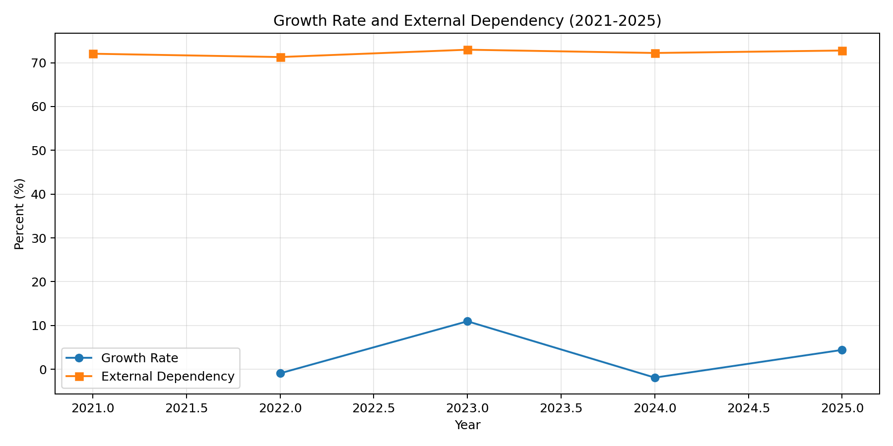
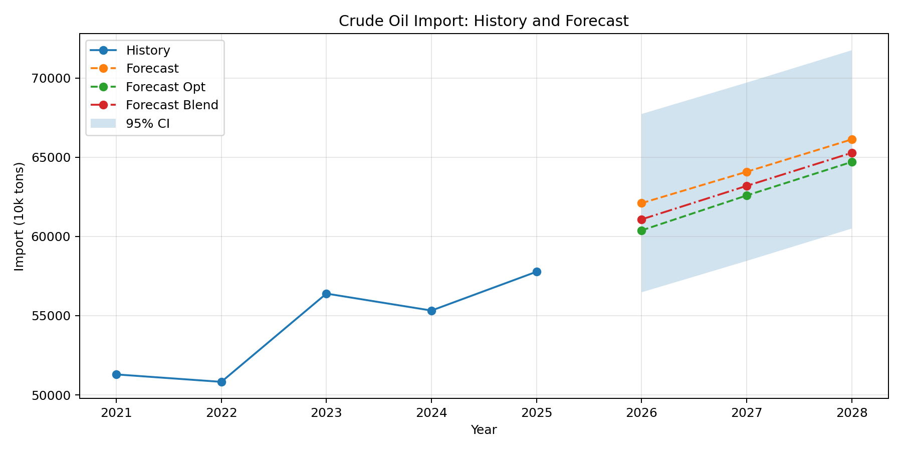

# 中国原油进口布局和安全策略 - 建模分析报告

## 一、数据概述

### 1.1 年度数据（附件1）
**数据来源**：国家统计局、海关总署  
**时间范围**：2016-2025年（部分指标至2024年）  
**关键数据 - 中国原油进口量（万吨）**：

| 年份 | 原油进口量 | 同比增长率 |
|------|-----------|-----------|
| 2016 | 38,101 | - |
| 2017 | 41,946 | 10.09% |
| 2018 | 46,189 | 10.12% |
| 2019 | 50,568 | 9.48% |
| 2020 | 54,201 | 7.19% |
| 2021 | 51,292 | -5.37% |
| 2022 | 50,823 | -0.91% |
| 2023 | 56,394 | 10.96% |
| 2024 | 55,323 | -1.90% |
| 2025 | 57,773 | 4.43% |

### 1.2 2025年15国进口数据（附件2）
**数据范围**：2025年1-12月原油进口数据  
**进口量排名前10国（万吨）**：

| 排名 | 国家 | 进口量 |
|------|------|--------|
| 1 | 俄罗斯 | 10,072 |
| 2 | 沙特阿拉伯 | 8,076 |
| 3 | 伊拉克 | 6,462 |
| 4 | 马来西亚 | 6,441 |
| 5 | 巴西 | 4,708 |
| 6 | 阿联酋 | 3,751 |
| 7 | 阿曼 | 3,535 |
| 8 | 安哥拉 | 2,976 |
| 9 | 科威特 | 1,902 |
| 10 | 加拿大 | 1,633 |

---

## 二、问题1：趋势分析与预测模型

### 2.1 问题分析
根据补充后的年度数据，需要完成以下任务：
1. 统计 2021-2025 年原油进口量、原油产量、年度增长率、对外依存度。
2. 基于 2016-2025 年进口量序列进行 2026-2028 年预测。
3. 给出模型精度评估，并避免仅靠样本内指标判断优劣。

### 2.2 推荐模型

#### 模型选择：GM(1,1) + 残差 AR(1) 修正 + 滚动回测融合

**选择理由**：
- 样本总长度仅 10 期，GM(1,1) 对小样本更稳定。
- 原始 GM 在本数据上达到二级精度，可通过残差建模提升拟合质量。
- 为避免过拟合，加入滚动回测并据此计算融合权重，输出保守预测值。

### 2.3 建模步骤

#### 步骤1：数据预处理
- 从 [data/年度数据_补充版.csv](data/年度数据_补充版.csv) 提取两条序列：原油进口量、原油产量。
- 年度增长率计算：
  $$g_t=\frac{x_t-x_{t-1}}{x_{t-1}}\times 100\%$$
- 对外依存度计算：
  $$d_t=\frac{\text{进口量}_t}{\text{进口量}_t+\text{产量}_t}\times 100\%$$

#### 步骤2：GM(1,1)模型构建
1. 构造 1-AGO 序列并建立灰微分方程：
   $$x^{(0)}(k)+az^{(1)}(k)=b$$
2. 最小二乘估计参数 $a,b$，得到基础预测值 $\hat x_t^{GM}$。
3. 得到基础残差：
   $$e_t=x_t-\hat x_t^{GM}$$

#### 步骤3：残差 AR(1) 修正
- 对残差拟合：
  $$e_t=c+\phi e_{t-1}+\varepsilon_t$$
- 构造修正预测：
  $$\hat x_t^{OPT}=\hat x_t^{GM}+\hat e_t$$

#### 步骤4：稳健性校验与融合
- 留出回测：用 2016-2024 训练，预测 2025。
- 滚动回测：2022-2025 逐年训练-预测，计算两模型 MAPE。
- 依据滚动 MAPE 反比确定优化模型权重 $w$，形成融合预测：
  $$\hat x_t^{BLEND}=w\hat x_t^{OPT}+(1-w)\hat x_t^{GM}$$

### 2.4 实际运行结果

#### 1) 2021-2025 年数据特征（事实层）

由 [results/problem1/问题1_2021_2025分析.csv](results/problem1/问题1_2021_2025分析.csv) 可得：

| 年份 | 进口量(万吨) | 产量(万吨) | 增长率(%) | 对外依存度(%) |
|---|---:|---:|---:|---:|
| 2021 | 51292 | 19898 | - | 72.05 |
| 2022 | 50823 | 20467 | -0.91 | 71.29 |
| 2023 | 56394 | 20891 | 10.96 | 72.97 |
| 2024 | 55323 | 21282 | -1.90 | 72.22 |
| 2025 | 57773 | 21605 | 4.43 | 72.78 |

解释要点：
1. 进口量近五年呈“波动上行”，不是单调增长。
2. 依存度稳定在 72% 左右，说明中国原油供应对进口依赖仍处高位。
3. 2023 年的高增长与 2024 年的回调体现了国际供需与价格冲击下的短期扰动。



#### 2) 2026-2028 年预测结果（输出层）

由 [results/problem1/问题1_2026_2028预测.csv](results/problem1/问题1_2026_2028预测.csv) 可得：

| 年份 | 基础GM预测(万吨) | 优化预测(万吨) | 融合预测(万吨) | 95%下界 | 95%上界 |
|---|---:|---:|---:|---:|---:|
| 2026 | 62102.98 | 60382.21 | 61078.48 | 56475.27 | 67730.69 |
| 2027 | 64082.45 | 62586.77 | 63191.97 | 58454.74 | 69710.16 |
| 2028 | 66125.02 | 64702.67 | 65278.19 | 60497.31 | 71752.73 |

解释要点：
1. 三种预测都指向未来三年总体增长。
2. 优化预测相对基础GM更保守，融合预测介于两者之间，适合作为报告主结果。
3. 区间宽度提示了不确定性范围，政策建议中应避免把点预测当作唯一值。



#### 3) 2025 留出回测（泛化层）

为验证“不是只在样本内拟合得好”，采用留出法：
1. 用 2016-2024 训练模型。
2. 预测 2025，再与真实值比较。

由 [results/problem1/问题1_模型评估.csv](results/problem1/问题1_模型评估.csv) 可得：

| 指标 | 数值 |
|---|---:|
| 2025真实值(万吨) | 57773.00 |
| 2025基础预测(万吨) | 60661.43 |
| 2025优化预测(万吨) | 58589.68 |
| 留出MAPE-基础(%) | 5.00 |
| 留出MAPE-优化(%) | 1.41 |

解释要点：
1. 优化模型在样本外（2025）误差明显更小，说明优化不是纯粹“样本内美化”。
2. 这也是后续采用融合预测而非单一基础GM的重要依据。

#### 4) 全部评估指标（检验层）

同样来自 [results/problem1/问题1_模型评估.csv](results/problem1/问题1_模型评估.csv)：

| 指标 | 数值 | 解释 |
|---|---:|---|
| C_base | 0.4477 | 基础GM后验差比（二级精度） |
| P_base | 0.8000 | 基础GM小误差概率 |
| C_opt | 0.3196 | 优化模型后验差比（一级精度） |
| P_opt | 1.0000 | 优化模型小误差概率 |
| MAPE_opt_in_sample(%) | 3.21 | 优化模型样本内平均误差 |
| rolling_mape_base(%) | 8.60 | 2022-2025滚动回测基础误差 |
| rolling_mape_opt(%) | 5.84 | 2022-2025滚动回测优化误差 |
| blend_weight_opt | 0.5954 | 融合预测中优化模型权重 |

说明：
1. $P=1.0$ 本身不能单独证明“泛化完美”，因此必须配合留出回测和滚动回测一起解释。
2. 本文已经通过 2025 留出与 2022-2025 滚动回测验证优化模型更稳健。

### 2.5 给队友的统一口径（汇报可直接复述）

1. 问题1我们采用“GM(1,1)基础预测 + 残差AR(1)修正 + 滚动回测融合”的三层方案。
2. 基础GM负责抓主趋势，残差AR(1)负责修正系统偏差，滚动回测负责防止过拟合。
3. 最终报告建议使用“融合预测”作为主结论，基础预测和优化预测作为对照组。
4. 数据结论是：进口量未来三年仍上行；依存度维持在约72%的高位；短期安全风险仍需通过来源多元化和储备策略缓释。

### 2.6 结论
1. 近五年原油进口总量总体上行，年际波动明显。
2. 对外依存度稳定在 72% 左右，能源对外依赖程度较高。
3. 基础 GM 可用，但优化与滚动校验后结果更稳健。
4. 建议在正文中以融合预测作为主结果，优化预测与基础预测作为敏感性对照。

---

## 三、问题2：综合风险评估模型

### 3.1 问题分析
需要构建多因素综合风险评估体系，考虑：
- 地缘政治风险
- 运输通道风险
- 经济成本因素
- 供应稳定性
- 新能源增长影响

### 3.2 推荐模型

#### 模型选择：层次分析法（AHP）+ 模糊综合评价法组合

**选择理由**：

| 模型 | 适用场景 | 本问题匹配度 |
|------|----------|-------------|
| 层次分析法(AHP) | 多准则决策、指标权重确定 | ★★★★★ 符合多因素分层结构 |
| 模糊综合评价 | 模糊边界、定性定量结合 | ★★★★★ 政治风险难以精确量化 |
| TOPSIS法 | 多指标综合评价 | ★★★★☆ 可作为补充验证 |
| 主成分分析 | 降维处理 | ★★★☆☆ 指标数量适中 |

**组合模型优势**：
- AHP确定各风险因素权重，避免主观随意性
- 模糊评价处理地缘政治等模糊性指标
- 层次清晰，逻辑严密

### 3.3 建模步骤

#### 步骤1：建立风险评估指标体系

```
目标层A：中国原油进口综合风险

├─ 准则层B
│  ├─ B1 地缘政治风险
│  │   ├─ C11 中东地区冲突指数
│  │   ├─ C12 霍尔木兹海峡通行风险
│  │   └─ C13 中美关系影响系数
│  │
│  ├─ B2 运输通道风险
│  │   ├─ C21 海运依赖度
│  │   ├─ C22 关键海峡封锁概率
│  │   └─ C23 替代路线覆盖率
│  │
│  ├─ B3 经济成本风险
│  │   ├─ C31 价格波动率
│  │   ├─ C32 运输距离成本
│  │   └─ C33 汇率风险
│  │
│  ├─ B4 供应稳定性风险
│  │   ├─ C41 来源国政治稳定性
│  │   ├─ C42 贸易协议保障度
│  │   └─ C43 供应中断历史记录
│  │
│  └─ B5 新能源替代风险
│      ├─ C51 新能源发展速度
│      ├─ C52 替代能源技术成熟度
│      └─ C53 政策支持力度
```

#### 步骤2：AHP层次分析法确定权重

1. **构造判断矩阵**
   
   对同一层次各元素进行两两比较，构造判断矩阵A：
   $$a_{ij} = \frac{第i个因素}{第j个因素}$$

   采用1-9标度法：
   | 重要性等级 | 赋值 |
   |-----------|------|
   | 同等重要 | 1 |
   | 稍微重要 | 3 |
   | 较强重要 | 5 |
   | 非常重要 | 7 |
   | 绝对重要 | 9 |
   | 相邻判断中间值 | 2,4,6,8 |

2. **计算权重向量**

   - 计算矩阵各行元素的几何均值：
     $$W_i = \sqrt[n]{\prod_{j=1}^{n} a_{ij}}$$

   - 归一化处理：
     $$w_i = \frac{W_i}{\sum_{i=1}^{n} W_i}$$

3. **一致性检验**
   - 计算最大特征值：$\lambda_{max} = \sum_{i=1}^{n} \frac{(AW)_i}{n \cdot w_i}$
   - 计算一致性指标：$CI = \frac{\lambda_{max} - n}{n - 1}$
   - 计算一致性比率：$CR = \frac{CI}{RI}$
   - 当 CR < 0.1 时，通过一致性检验

#### 步骤3：模糊综合评价

1. **确定评价等级**
   
   设评价等级集合为：
   $$V = \{v_1, v_2, v_3, v_4, v_5\} = \{很低, 低, 中, 高, 很高\}$$

2. **构造隶属函数**

   采用梯形隶属函数或三角形隶属函数：
   $$\mu_{v_1}(x) = \begin{cases} 1, & x \leq s_1 \\ \frac{s_2-x}{s_2-s_1}, & s_1 < x \leq s_2 \\ 0, & x > s_2 \end{cases}$$

3. **建立模糊评价矩阵**

   对每个国家j，建立模糊评价矩阵：
   $$R_j = \begin{pmatrix} r_{11} & r_{12} & r_{13} & r_{14} & r_{15} \\ r_{21} & r_{22} & r_{23} & r_{24} & r_{25} \\ \vdots & \vdots & \vdots & \vdots & \vdots \\ r_{n1} & r_{n2} & r_{n3} & r_{n4} & r_{n5} \end{pmatrix}$$

   其中 $r_{ij}$ 表示第i个指标对第j评价等级的隶属度。

4. **综合评价**

   $$B_j = W \cdot R_j = (w_1, w_2, ..., w_n) \cdot \begin{pmatrix} r_{11} & r_{12} & r_{13} & r_{14} & r_{15} \\ \vdots & \vdots & \vdots & \vdots & \vdots \\ r_{n1} & r_{n2} & r_{n3} & r_{n4} & r_{n5} \end{pmatrix}$$

5. **风险等级确定**

   采用最大隶属度原则或加权平均法确定最终风险等级。

### 3.4 定量数据计算

根据附件2数据，可计算各来源国的：
- 进口量占比（运输集中度风险）
- 进口金额占比（经济权重）

```
进口集中度 = 该国进口量 / 总进口量 × 100%

中东占比 = (沙特+伊拉克+阿曼+科威特+卡塔尔+阿联酋) / 总进口量 × 100%
```

### 3.5 预期输出
- 各国家综合风险评分
- 风险等级分类结果
- 风险热力图/雷达图
- 主要风险因素排序

---

## 四、问题3：应急响应优化模型

### 4.1 问题分析
需要建立原油进口应急响应模型，优化来源结构配置，应对突发情况（如战争导致霍尔木兹海峡封锁）。

### 4.2 推荐模型

#### 模型选择：多目标规划 + 整数规划组合

**选择理由**：

| 模型 | 适用场景 | 本问题匹配度 |
|------|----------|-------------|
| 多目标规划 | 多约束、多目标优化 | ★★★★★ 成本、风险、供应量多目标 |
| 整数规划 | 资源配置离散决策 | ★★★★☆ 国家数量为整数变量 |
| 动态规划 | 多阶段决策 | ★★★★☆ 应急响应有时间阶段 |
| 随机规划 | 不确定性优化 | ★★★☆☆ 风险场景可预设 |
| 遗传算法 | NP难问题求解 | ★★★★☆ 大规模组合优化 |

**组合模型优势**：
- 多目标规划处理成本最小化、风险最小化、供应最大化
- 整数约束确保国家选择的离散性
- 可引入情景分析应对不确定性

### 4.3 建模步骤

#### 步骤1：定义决策变量

设 $x_j$ 为从第j个国家（地区）的原油进口量（万吨），j = 1, 2, ..., n（n=15）

设 $y_j \in \{0,1\}$ 为二元变量，表示是否选择从国家j进口

#### 步骤2：建立目标函数

**目标1：总成本最小化**
$$\min Z_1 = \sum_{j=1}^{n} c_j \cdot x_j$$

其中 $c_j$ 为从国家j进口的单位成本（元/吨）

**目标2：综合风险最小化**
$$\min Z_2 = \sum_{j=1}^{n} r_j \cdot x_j$$

其中 $r_j$ 为国家j的风险评分（来自问题2）

**目标3：供应保障最大化**
$$\max Z_3 = \sum_{j=1}^{n} x_j$$

#### 步骤3：建立约束条件

**约束1：总进口量约束**
$$\sum_{j=1}^{n} x_j \geq Q_{min}$$

其中 $Q_{min}$ 为最低保障进口量（考虑国内生产和储备）

**约束2：替代路线约束（霍尔木兹海峡封锁情景）**
$$\sum_{j \in MiddleEast} x_j \leq \alpha \cdot \sum_{j=1}^{n} x_j$$

其中 $\alpha$ 为中东进口比例上限（如设定为30%）

**约束3：单国依赖度约束**
$$\frac{x_j}{\sum_{i=1}^{n} x_i} \leq \beta_j, \quad \forall j$$

其中 $\beta_j$ 为国家j的最大占比限制（如俄罗斯不超过20%）

**约束4：最低供应国数量约束**
$$\sum_{j=1}^{n} y_j \geq N_{min}$$

确保至少从 $N_{min}$ 个国家进口

**约束5：二元变量约束**
$$x_j \leq M \cdot y_j, \quad \forall j$$

其中M为大常数

**约束6：非负约束**
$$x_j \geq 0, \quad y_j \in \{0,1\}$$

#### 步骤4：情景分析

预设典型应急情景：

| 情景 | 描述 | 参数调整 |
|------|------|---------|
| S1 | 霍尔木兹海峡封锁 | 中东国家进口量=0 |
| S2 | 俄乌冲突升级 | 俄罗斯进口量降50% |
| S3 | 南海紧张 | 马来西亚进口量降50% |
| S4 | 综合中断 | 前3大来源国各降50% |

#### 步骤5：模型求解

采用以下方法求解多目标规划：

1. **线性加权法**：将多目标转化为单目标
   $$\min Z = \lambda_1 Z_1 + \lambda_2 Z_2 - \lambda_3 Z_3$$

2. **ε-约束法**：保留一个主要目标，将其他目标作为约束

3. **求解工具**：LINGO、CPLEX 或 Python (PuLP库)

### 4.4 预期输出
- 最优进口配置方案
- 不同情景下的应急响应方案
- 关键瓶颈分析
- 储备策略建议

---

## 五、问题4：政策建议

### 5.1 建议内容框架

基于以上模型分析，给商务部撰写建议信，重点包括：

#### 建议一：构建多元化进口来源体系
- 降低中东地区依赖度（从70%降至50%以下）
- 增加非洲、南美、俄罗斯进口比例
- 开发新的合作国家（如加拿大、巴西深耕）

#### 建议二：完善能源运输通道战略布局
- 建设中巴经济走廊原油管道
- 推进中俄原油管道二期
- 开辟绕过霍尔木兹海峡的替代路线

#### 建议三：建立原油战略储备动态调节机制
- 完善三级储备体系
- 建立价格-储备联动机制
- 加强与主要消费国的协调储备

#### 建议四：加快新能源替代与能源转型
- 加大新能源汽车推广力度
- 发展氢能、核能等替代能源
- 推进石油产品替代战略

### 5.2 建议信格式要求
- 篇幅：1-2页
- 对象：商务部
- 语气：正式公函
- 数据支撑：引用模型计算结果

---

## 六、模型方法汇总表

| 问题 | 核心模型 | 辅助方法 | 求解工具 |
|------|---------|---------|---------|
| 问题1 | GM(1,1)灰色预测 | 时间序列分析 | Python/MATLAB |
| 问题2 | AHP+模糊综合评价 | TOPSIS验证 | Python/Yaahp |
| 问题3 | 多目标整数规划 | 情景分析 | LINGO/PuLP |
| 问题4 | 定性定量结合 | 案例研究 | Word |

---

## 七、数据来源说明

1. **附件1：年度数据.xls**
   - 来源：国家统计局、海关总署
   - 内容：2016-2025年能源进出口数据
   - 关键指标：原油进口量（万吨）

2. **附件2：2025年1-12月原油进口15国数据.xlsx**
   - 来源：海关总署
   - 内容：2025年1-12月中国原油进口来源国数据
   - 关键指标：进口量（千克/桶）、金额（人民币）

3. **模型.pdf**
   - 来源：模型参考资料
   - 内容：预测模型、优化模型、评价模型三大类方法论

---

## 八、注意事项

1. **数据单位**：附件2中进口量单位为"千克"，需转换为"万吨"（除以10^10）
2. **依存度计算**：需结合国内产量数据，题目给出2025年进口约5.78亿吨，对外依存度72.7%
3. **模型检验**：预测模型需进行精度检验，优化模型需进行灵敏度分析
4. **敏感性分析**：应急模型需分析关键参数变化对结果的影响

---

*报告生成时间：2026年*
*数据更新日期：基于用户提供附件*
